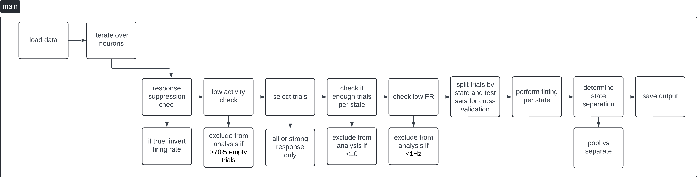
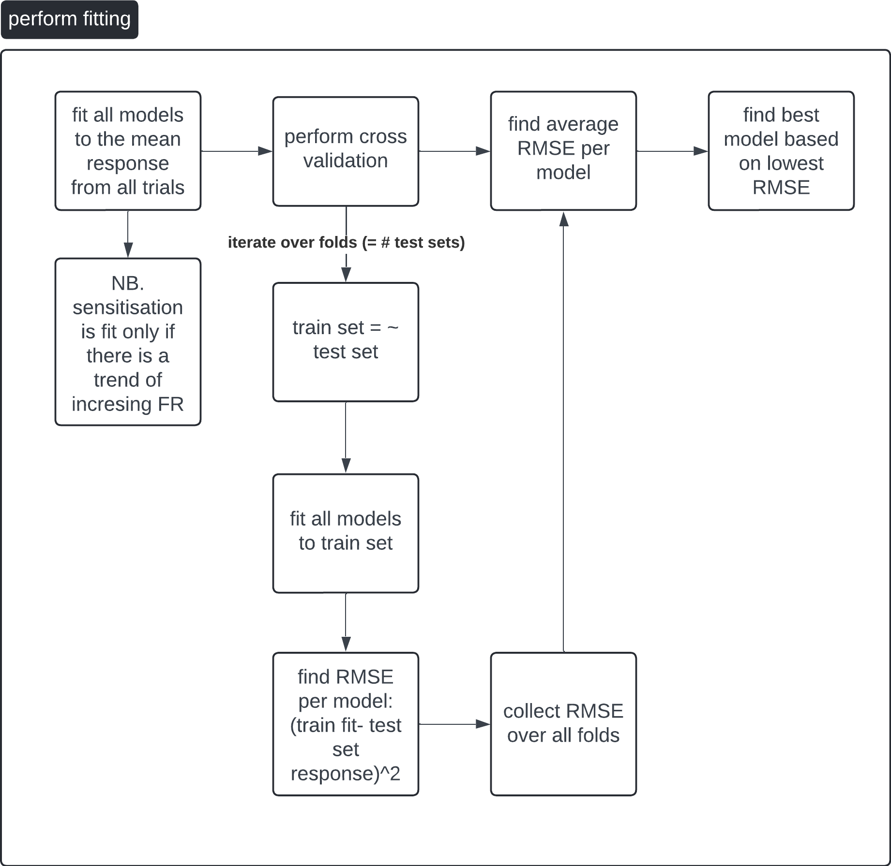

# Exponential Model Fitting

## Introduction

This code is designed to fit various exponential models to neuronal response data.

### Models include:
- **Adaptation**: Models decreasing neuronal response over time.
- **Sensitisation**: Models increasing neuronal response.
- **Mixed**: Combines adaptation and sensitisation components.
- **Flat**: Assumes no change in neuronal response over time.

### Key applications include:
- Understanding adaptation mechanisms in neurons.
- Comparing neuronal response dynamics between states.

---

## Details About Fitting

### Fitting Process
- Models are fit starting from the **peak of the response** and continue until near the end to avoid edge effects from convolution.
- All models share the same response window, which is defined using the `data_window` function.
- The fitting process employs **constrained and bounded optimization** using the `scipy.minimize` function. Constraints were customized for each model based on the understanding of the data characteristics.
- K-fold cross validation is performed to find the best model per neuron's response. Results of the cross validation are also used to find state separation i.e. whether the responses are distinct enough to be separated by state (running/stationary)

---

## Pipeline Overview

Overview of main:

Overview of the main fitting function:

---

